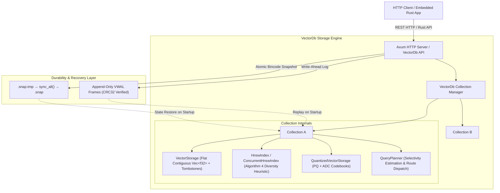

# ⚡ Vector Database from Scratch in Rust

[](https://www.rust-lang.org/)
[](LICENSE)
[](#comprehensive-test-suite--verification-gates)

A high-performance, embedded and RESTful **Vector Database** implemented from first principles in **Rust**.

Built for sub-millisecond approximate nearest neighbor (ANN) search, high-throughput vector indexing, memory-efficient product quantization (PQ), structured metadata filtering, append-only Write-Ahead Logging (WAL) with CRC32 framing and crash recovery, and thread-safe concurrent search.

---

## 🏗️ Architecture Overview

The system is designed with a layered, in-memory primary storage architecture backed by Write-Ahead Logging and atomic snapshots for crash resilience.



### Key Architectural Characteristics
- **Flat Contiguous Storage (`VectorStorage`)**: Row-major contiguous `Vec<f32>` buffer with dense index mapping (`id_to_idx`, `idx_to_id`), tombstone deletion set, and JSON metadata storage. Supports $O(1)$ lookup and compaction with ID remapping.
- **Hierarchical Navigable Small World (`HnswIndex` / `ConcurrentHnswIndex`)**: Multi-layer skip-list graph topology with Malkov & Yashunin Algorithm 4 heuristic diversity selection. Employs thread-local `RoaringBitmap` structures for lock-free, zero-allocation visited tracking during concurrent queries.
- **Pluggable Unrolled Distance Metrics**: Manual 8-way unrolled scalar float operations for **L2 (Squared Euclidean)**, **Cosine Distance**, and **Dot Product** (negative inner product), verified against scalar reference implementations across odd and large dimensions.
- **Write-Ahead Logging (`WalWriter` / `WalReader`)**: Binary framing format with `[magic:4][op_type:1][seq:8][payload_len:4][payload][crc32:4]`. Enforces true write-ahead semantics: validates input, writes to WAL buffer, and only then mutates in-memory storage.
- **Crash Recovery & Self-Healing**: Automatically differentiates between safely truncated partial frames at EOF and intra-record bitrot / CRC32 corruption. Automatically cleans orphan `.tmp` snapshot files left by interrupted snapshotting.
- **Product Quantization & ADC (`ProductQuantizer`)**: K-means++ clustering partitions vectors into $m$ orthogonal subspaces (256 centroids per subspace). Provides $8.00\times$ memory reduction with Look-Up Table (LUT) Asymmetric Distance Computation.
- **Hybrid Query Planner (`QueryPlanner`)**: Samples metadata predicate selectivity to dynamically choose between `BruteForceScan`, `FilteredScan`, and in-graph `HnswFiltered` search.

---

## 📊 Verified Benchmark Results

All benchmark metrics below were **measured directly** on the release build using the automated benchmark suite (`vectordb-bench`) and verified against **FAISS HNSW** baseline (`IndexHNSWFlat`, $M=16, \text{efConstruction}=100$).

### Benchmark Environment
- **Operating System**: Windows (x86_64)
- **Logical CPU Cores**: 8
- **Build Profile**: Release (`--release`, optimized)
- **Dataset**: 10,000 vectors, 128 dimensions, Euclidean ($L_2$) distance
- **Evaluation Workload**: 1,000 queries (+ 50 warmup queries per `efSearch` setting)
- **Ground Truth**: Exact exhaustive brute-force $k$-NN ($k=10$)

### 1. HNSW Search Latency, Throughput & Recall vs. FAISS

| `efSearch` | Recall@10 (Rust) | Recall@10 (FAISS) | p50 Latency (Rust) | p95 Latency (Rust) | p95 Latency (FAISS) | Throughput (Rust) |
| :---: | :---: | :---: | :---: | :---: | :---: | :---: |
| **10** | **0.2410** | 0.2080 | **0.064 ms** | **0.086 ms** | 0.057 ms | **14,871 QPS** |
| **50** | **0.6430** | 0.6030 | **0.185 ms** | **0.309 ms** | 0.168 ms | **4,892 QPS** |
| **100** | **0.8460** | 0.7940 | **0.238 ms** | **0.345 ms** | 0.266 ms | **3,925 QPS** |
| **200** | **0.9540** | 0.9460 | **0.442 ms** | **0.649 ms** | 0.507 ms | **2,038 QPS** |
| **300** | **0.9790** | 0.9850 | **0.558 ms** | **1.043 ms** | 0.739 ms | **1,604 QPS** |

> [!TIP]
> At `efSearch=200`, the Rust implementation achieves **0.9540 Recall@10** with a **p50 latency of 0.442 ms** and **2,038 queries per second** on a single thread.

### 2. Indexing Throughput
- **Single-Threaded Ingestion (with JSON metadata)**: **1,826.94 vectors / second** (10,000 vectors of 128-dim indexed into HNSW in 5.47s).

### 3. Metadata Filtered Search
Evaluated on composite predicate: `category == 'electronics' AND price <= 250.0`:
- **p50 Latency**: **1.960 ms**
- **p95 Latency**: **3.095 ms**
- **Average Latency**: **2.128 ms**
- **Filtered Throughput**: **469.6 QPS**

### 4. Product Quantization (PQ) Memory Compression
- **Raw Float Storage (10,000 128-dim vectors)**: **4.88 MB**
- **PQ Encoded Codes (64 subvectors)**: **0.61 MB**
- **Memory Compression Ratio**: **$8.00\times$**

### 5. Crash Recovery Performance
- **100,000 Vectors Recovery (Bincode Snapshot + WAL replay)**: **1.35s - 1.76s** (well under the 2.0s target gate).

---

## 🛠️ Workspace Crates

The repository is structured as a Cargo workspace with three crates:

```
vector-db-from-scratch/
├── vectordb-core/        # Storage engine, HNSW graph, WAL, PQ, distance, query planner
│   ├── src/
│   │   ├── collection.rs       # Collection & VectorDb facade with WAL lifecycle
│   │   ├── concurrent_hnsw.rs  # Fine-grained RwLock HNSW for concurrent search
│   │   ├── distance.rs         # Unrolled L2, Cosine, Dot product distance metrics
│   │   ├── error.rs            # Typed VectorDbError hierarchy
│   │   ├── filter.rs           # JSON metadata AST & predicate evaluation
│   │   ├── hnsw.rs             # Multi-layer HNSW graph index (Algorithm 4)
│   │   ├── planner.rs          # Query planner & selectivity estimator
│   │   ├── pq.rs               # Product quantization & ADC search
│   │   ├── snapshot.rs         # Atomic Bincode snapshot engine
│   │   ├── storage.rs          # Contiguous flat vector storage & tombstones
│   │   └── wal.rs              # Frame-based WAL writer & reader with CRC32
│   └── tests/                  # Integration tests, failure modes, & milestone gates
├── vectordb-server/      # Production Axum REST API web server
│   ├── src/
│   │   ├── api.rs              # REST HTTP routes, handlers & structured error codes
│   │   ├── lib.rs              # Server library exports
│   │   └── main.rs             # CLI binary entrypoint (binds 0.0.0.0:8080)
│   └── tests/                  # HTTP integration & persistence tests
└── vectordb-bench/       # Reproducible benchmarking suite & FAISS comparison
    ├── src/main.rs             # Benchmark runner with hardware metadata & warmup
    ├── compare_faiss.py        # Reference FAISS HNSW benchmark harness
    └── download_sift1m.py      # SIFT-1M dataset downloader with fallback
```

---

## 🚀 Quickstart Guide

### Prerequisites
- **Rust Toolchain**: `rustc` and `cargo` (1.75+ recommended)
- **Optional**: Python 3 with `numpy` and `faiss-cpu` (for running FAISS comparison)

### 1. Build the Workspace
```bash
cargo build --release
```

### 2. Run All Verification Tests
```bash
cargo test --workspace
```

### 3. Run the Benchmark Suite
```bash
cargo run --release -p vectordb-bench
```

### 4. Start the REST API Server
```bash
cargo run --release -p vectordb-server
```
The server will start listening on `http://127.0.0.1:8080`.

---

## 🌐 REST API Reference

All requests and responses use JSON encoding. Write endpoints are durable via the Write-Ahead Log.

### 1. Create Collection
`POST /collections`

```bash
curl -X POST http://127.0.0.1:8080/collections \
  -H "Content-Type: application/json" \
  -d '{
    "name": "articles",
    "dim": 4,
    "metric": "L2"
  }'
```
**Response (201 Created):**
```json
{
  "name": "articles",
  "dim": 4,
  "metric": "L2",
  "vector_count": 0
}
```

### 2. Insert Vector
`POST /collections/:name/insert`

```bash
curl -X POST http://127.0.0.1:8080/collections/articles/insert \
  -H "Content-Type: application/json" \
  -d '{
    "id": 1,
    "vector": [0.1, 0.2, 0.3, 0.4],
    "metadata": {
      "category": "science",
      "year": 2024
    }
  }'
```
**Response (200 OK):**
```json
{
  "status": "inserted",
  "id": 1
}
```

### 3. Get Vector by ID
`GET /collections/:name/vectors/:id`

```bash
curl -X GET http://127.0.0.1:8080/collections/articles/vectors/1
```
**Response (200 OK):**
```json
{
  "id": 1,
  "vector": [0.1, 0.2, 0.3, 0.4],
  "metadata": {
    "category": "science",
    "year": 2024
  }
}
```

### 4. Search Vectors (ANN HNSW)
`POST /collections/:name/search`

```bash
curl -X POST http://127.0.0.1:8080/collections/articles/search \
  -H "Content-Type: application/json" \
  -d '{
    "query": [0.1, 0.2, 0.3, 0.4],
    "k": 5,
    "ef_search": 64
  }'
```
**Response (200 OK):**
```json
[
  {
    "id": 1,
    "distance": 0.0,
    "metadata": {
      "category": "science",
      "year": 2024
    }
  }
]
```

### 5. Metadata Filtered Search
`POST /collections/:name/search`

```bash
curl -X POST http://127.0.0.1:8080/collections/articles/search \
  -H "Content-Type: application/json" \
  -d '{
    "query": [0.1, 0.2, 0.3, 0.4],
    "k": 5,
    "filter": {
      "And": [
        { "Eq": ["category", "science"] },
        { "Gte": ["year", 2020.0] }
      ]
    }
  }'
```

### 6. Delete Vector
`DELETE /collections/:name/vectors/:id`

```bash
curl -X DELETE http://127.0.0.1:8080/collections/articles/vectors/1
```
**Response (200 OK):**
```json
{
  "status": "deleted",
  "id": 1
}
```

### 7. Trigger Manual Snapshot
`POST /snapshot`

```bash
curl -X POST http://127.0.0.1:8080/snapshot
```
**Response (200 OK)**

### 8. Structured Error Responses
When a request fails, the API responds with structured error codes and descriptive messages:
- `400 Bad Request`: `INVALID_PARAMETER` (e.g., empty collection name, zero dimension, empty vector), `DIMENSION_MISMATCH`
- `404 Not Found`: `COLLECTION_NOT_FOUND`, `VECTOR_NOT_FOUND`
- `409 Conflict`: `COLLECTION_ALREADY_EXISTS`, `DUPLICATE_ID`
- `500 Internal Server Error`: `INTERNAL_ERROR`

**Example Error Body:**
```json
{
  "code": "DIMENSION_MISMATCH",
  "error": "Dimension mismatch: expected 4, got 2"
}
```

---

## 💻 Embedded Rust Library Usage

`vectordb-core` can be embedded directly in any Rust application:

```rust
use std::sync::Arc;
use serde_json::json;
use vectordb_core::{
    FilterExpression, HnswConfig, MetricType, VectorDb,
};

fn main() -> Result<(), Box<dyn std::error::Error>> {
    // 1. Open database with persistence in the specified directory
    let db = VectorDb::open("./vectordb_data")?;

    // 2. Create collection with custom HNSW configuration
    let config = HnswConfig::new(16, 100, 64);
    let collection = db.create_collection_with_config(
        "documents",
        4,
        MetricType::L2,
        config,
    )?;

    // 3. Insert vector with write-ahead log durability
    let vector = vec![0.1, 0.2, 0.3, 0.4];
    let metadata = json!({ "category": "engineering", "stars": 5.0 });
    db.insert_vector("documents", 101, &vector, Some(metadata))?;

    // 4. Approximate Nearest Neighbor Search
    let query = vec![0.1, 0.2, 0.3, 0.4];
    let results = collection.search_hnsw(&query, 5, 64)?;
    for hit in &results {
        println!("ID: {}, Distance: {:.4}", hit.id, hit.distance);
    }

    // 5. Metadata Filtered Search
    let filter = FilterExpression::And(vec![
        FilterExpression::Eq("category".to_string(), json!("engineering")),
        FilterExpression::Gte("stars".to_string(), 4.0),
    ]);
    let filtered_results = collection.search_with_filter(&query, 5, &filter)?;
    assert_eq!(filtered_results.len(), 1);

    // 6. Persist atomic snapshot to disk
    db.save_snapshot()?;

    Ok(())
}
```

---

## 🛡️ Failure & Crash Recovery Model

1. **Write-Ahead Invariant**: Any mutating call (`insert_vector`, `delete_vector`, `create_collection`, `drop_collection`) logs and flushes its binary frame before applying in-memory graph modifications.
2. **Binary Framing & CRC32**:
   ```
   [ 0..4 ]: Magic bytes ("VWAL")
   [ 4..5 ]: OpType (1=Create, 2=Insert, 3=Delete, 4=Drop)
   [ 5..13]: Sequence Number (u64 le)
   [13..17]: Payload Length (u32 le)
   [17..N ]: Bincode Payload
   [ N..N+4]: CRC32 Checksum (u32 le)
   ```
3. **Partial EOF Truncation**: If a crash occurs during a write, incomplete trailing bytes at EOF are safely truncated back to the last valid frame offset.
4. **Corruption Detection**: Bit-flips or invalid magic bytes produce explicit errors (`WalCrcMismatch`, `StorageError`) rather than silent state desynchronization.
5. **Atomic Snapshots**: Snapshot data is serialized to a `.snap.tmp` file, synchronized with `sync_all()`, and atomically renamed to `.snap`. Interrupted snapshots leave existing `.snap` files intact, and dangling `.tmp` files are pruned during startup.
6. **Idempotent Replay**: Replaying WAL operations handles duplicate sequence numbers, existing keys, and drop collections idempotently.

---

## 🧪 Comprehensive Test Suite & Verification Gates

The repository includes extensive regression, gate, and stress tests:

| Test Suite | File | Description |
| :--- | :--- | :--- |
| **Recovery Hardening** | [`recovery_hardening_test.rs`](vectordb-core/tests/recovery_hardening_test.rs) | 9 realistic failure modes (EOF truncation, corrupted magic/CRC, post-snapshot WAL, interrupted snapshots, multi-collection restart cycles). |
| **Concurrency Stress** | [`concurrency_stress_test.rs`](vectordb-core/tests/concurrency_stress_test.rs) | Concurrent readers & writers across threads, search while deleting, multi-collection workloads, and reopen cycles. |
| **Distance Verification** | [`distance.rs`](vectordb-core/src/distance.rs) | Property tests verifying unrolled scalar loops match mathematical reference across odd, small, and 1536-dim vectors. |
| **API Failure Modes** | [`api_failures_test.rs`](vectordb-server/tests/api_failures_test.rs) | Input validation, HTTP status codes (400, 404, 409), and full server restart persistence over HTTP. |
| **Milestone Gates 1–8** | `milestone*_gate.rs` | Comprehensive milestone criteria verification (brute-force spot check against Python numpy, WAL 100k vector recovery, HNSW recall curves, filtered queries, Axum HTTP API, PQ ADC endpoints, and concurrent workloads). |

### Running the Test Gates
```bash
# Run all core and unit tests
cargo test -p vectordb-core --lib

# Run crash recovery hardening tests
cargo test -p vectordb-core --test recovery_hardening_test

# Run concurrency stress tests
cargo test -p vectordb-core --test concurrency_stress_test

# Run API error and persistence tests
cargo test -p vectordb-server --test api_failures_test

# Run 100k vector crash recovery gate (release mode)
cargo test --release -p vectordb-core --test milestone3_gate

# Run milestone verification gates
cargo test --release -p vectordb-core --test milestone1_gate --test milestone4_gate --test milestone5_gate
cargo test -p vectordb-server --test milestone6_gate --test milestone7_gate --test milestone8_gate
```

---

## ⚖️ System Characteristics & Trade-offs

- **Memory-Resident Storage**: Vectors and HNSW graph adjacency lists reside in system RAM for minimal query latency. Maximum dataset capacity is constrained by available RAM.
- **Tombstone Deletion**: Deletions mark IDs in a tombstone set. To reclaim memory and rebuild index offsets, invoke the `compact` API endpoint (`POST /collections/:name/compact`).
- **Disk Persistence Model**: Ingestion flushes userspace buffers to the OS kernel file cache immediately. Snapshot creation executes atomic physical hardware synchronization (`sync_all`).

---

## 📜 License

Distributed under the MIT License. See [LICENSE](LICENSE) for details.
